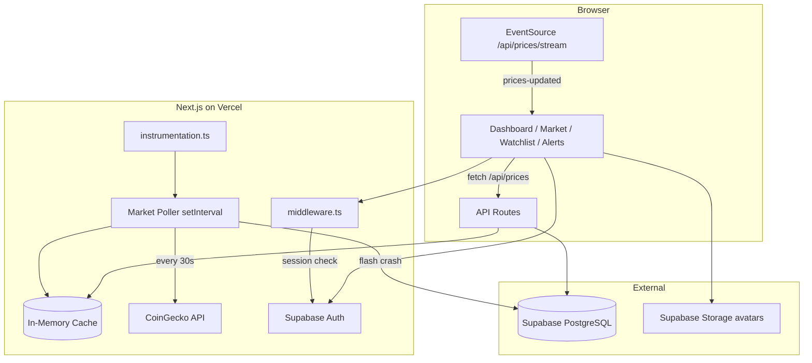

# Crypto Sentry — Complete Project Guide

This document explains **what** the project uses, **why** it uses it, and **how** each part works — from sign-up to live prices, alerts, and deployment.

---

## Table of contents

1. [What is Crypto Sentry?](#1-what-is-crypto-sentry)
2. [Tech stack — what & why](#2-tech-stack--what--why)
3. [High-level architecture](#3-high-level-architecture)
4. [Project structure](#4-project-structure)
5. [Environment variables](#5-environment-variables)
6. [Database — schema & where data lives](#6-database--schema--where-data-lives)
7. [Authentication](#7-authentication)
8. [Market data pipeline](#8-market-data-pipeline)
9. [Flash-crash detection & alerts](#9-flash-crash-detection--alerts)
10. [Watchlist](#10-watchlist)
11. [Profile & avatars](#11-profile--avatars)
12. [Settings](#12-settings)
13. [API routes](#13-api-routes)
14. [Logging & debugging](#14-logging--debugging)
15. [Deployment (Vercel + Supabase)](#15-deployment-vercel--supabase)
16. [Commands & common tasks](#16-commands--common-tasks)
17. [Known limitations on serverless](#17-known-limitations-on-serverless)

---

## 1. What is Crypto Sentry?

Crypto Sentry is a **crypto market monitoring dashboard** that:

- Shows **live prices** for the top 100 coins (via CoinGecko)
- Detects **flash price drops** and saves alerts to the database
- Lets signed-in users maintain a **personal watchlist**
- Supports **email/password** and **Google** sign-in with email OTP verification

The UI uses a cyber/terminal aesthetic. All dashboard pages require authentication.

---

## 2. Tech stack — what & why

| Technology | What it does | Why we use it |
|------------|--------------|---------------|
| **Next.js 15** (App Router) | Full-stack React framework | Server components, API routes, middleware, and deployment on Vercel in one repo |
| **React 19** | UI library | Component model for dashboard, auth forms, and live price widgets |
| **TypeScript** | Typed JavaScript | Safer refactors across API routes, Prisma, and UI |
| **Tailwind CSS 4** | Utility-first styling | Fast theming (`globals.css` tokens) and responsive layout |
| **Supabase Auth** | User sign-up, login, OAuth, sessions | Managed auth with cookies; no custom password hashing or JWT logic |
| **Supabase Storage** | Profile photo uploads | Public `avatars` bucket with RLS policies |
| **Supabase PostgreSQL** | Hosted Postgres | Same project as Auth; connection via pooler for serverless |
| **Prisma 7** | ORM + migrations | Type-safe queries for `Watchlist` and `CryptoAlert` tables |
| **`pg` + `@prisma/adapter-pg`** | Postgres driver adapter | Prisma 7 driver adapter for Node/serverless connections |
| **CoinGecko API** | Market prices | Top-100 coins in a single API call per poll cycle |
| **Server-Sent Events (SSE)** | Push price updates to browser | Browser refetches `/api/prices` only when cache changes (~30s) |
| **In-memory cache** (`globalThis`) | Hot price store | Avoids hitting CoinGecko on every page load; one poll serves all users |
| **Lucide React** | Icons | Consistent icon set across sidebar, auth, and cards |

---

## 3. High-level architecture



**Request flow (simplified):**

1. User opens dashboard → **middleware** checks Supabase session cookie.
2. UI connects to **SSE** and loads **cached prices** from `/api/prices`.
3. Background **poller** (started in `instrumentation.ts`) fetches CoinGecko every 30s.
4. New prices go into **memory cache** → SSE notifies browsers → UI refetches.
5. Large drops create **`CryptoAlert`** rows in Postgres.
6. Watchlist reads/writes **`Watchlist`** rows keyed by Supabase `user.id`.

---

## 4. Project structure

```
Crypto Sentry/
├── prisma/
│   ├── schema.prisma          # Watchlist + CryptoAlert models
│   └── migrations/            # SQL migration history
├── supabase/
│   └── avatars-bucket.sql       # One-time Storage bucket + RLS setup
├── src/
│   ├── app/
│   │   ├── (app)/               # Protected dashboard (sidebar layout)
│   │   │   ├── page.tsx         # Home terminal
│   │   │   ├── market/          # Top-100 explorer
│   │   │   ├── watchlist/       # User watchlist
│   │   │   ├── alerts/          # Flash-crash feed
│   │   │   ├── profile/         # Name + avatar
│   │   │   └── settings/        # Browser-only preferences
│   │   ├── auth/                # Login, signup, verify, callback, signout
│   │   ├── api/                 # REST handlers (prices, watchlist, alerts, market)
│   │   ├── layout.tsx           # Root layout + global CSS
│   │   └── globals.css          # Theme tokens
│   ├── components/              # UI by feature (auth, dashboard, market, etc.)
│   ├── hooks/
│   │   └── use-live-prices.ts   # SSE + /api/prices client hook
│   ├── lib/
│   │   ├── supabase/            # Browser + server clients, middleware session
│   │   ├── db/                  # Prisma client + watchlist helpers
│   │   ├── market/              # Poller, cache, CoinGecko fetch, flash-crash
│   │   ├── auth/                # Email verified flag, profile helpers
│   │   ├── logger.ts            # Structured in-memory + console logs
│   │   └── coingecko.ts         # Server read API for cache
│   ├── middleware.ts            # Auth gate for all non-auth routes
│   └── instrumentation.ts       # Starts market poller on Node boot
├── .env.example                 # Required env template
├── prisma.config.ts             # Prisma 7 datasource config
└── next.config.ts               # Images (CoinGecko, Google, Supabase storage)
```

---

## 5. Environment variables

Copy `.env.example` to `.env` locally. On Vercel, set the same keys in **Project → Settings → Environment Variables**.

| Variable | Required | Purpose |
|----------|----------|---------|
| `DATABASE_URL` | Yes | Supabase **pooler** URL for Prisma at runtime |
| `DIRECT_URL` | Optional | Direct Postgres URL if `migrate deploy` fails via pooler |
| `NEXT_PUBLIC_SUPABASE_URL` | Yes | Supabase project URL (also used at **build** for image domains) |
| `NEXT_PUBLIC_SUPABASE_ANON_KEY` | Yes | Public anon key for Supabase client |
| `COINGECKO_API_BASE_URL` | Yes | e.g. `https://api.coingecko.com/api/v3` |
| `COINGECKO_MARKETS_PATH` | Yes | e.g. `/coins/markets` |
| `COINGECKO_API_KEY` | No | Empty = free tier; set for demo/pro API |
| `COINGECKO_API_TIER` | If key set | `demo` or `pro` (selects correct API header) |
| `MARKET_POLL_INTERVAL_MS` | No | Default 30000; minimum 30000 |
| `LOG_VERBOSE` | No | Set to `1` for debug-level logs |

**Why two database URLs?**  
Serverless apps use the **connection pooler** (`DATABASE_URL`) for many short-lived connections. Migrations sometimes need the **direct** host (`DIRECT_URL`).

---

## 6. Database — schema & where data lives

Prisma manages two app tables in the **`public`** schema:

### `Watchlist`

| Column | Type | Meaning |
|--------|------|---------|
| `id` | String (cuid) | Row primary key |
| `user_id` | String | Supabase Auth user UUID |
| `asset_id` | String | CoinGecko coin id (e.g. `bitcoin`) |
| `asset_name` | String | Display name |
| `added_at` | DateTime | When added |

Unique constraint: one row per `(user_id, asset_id)`.

### `CryptoAlert`

| Column | Type | Meaning |
|--------|------|---------|
| `id` | String (cuid) | Alert id |
| `asset_id` | String | CoinGecko id |
| `asset_name` | String | Coin name |
| `price_at_drop` | Float | Price when drop detected |
| `drop_percentage` | Float | % change vs previous poll |
| `detected_at` | DateTime | Timestamp |

Alerts are **global** (not per-user) — any flash crash is stored once.

### What is NOT in Postgres

| Data | Stored in |
|------|-----------|
| User accounts | Supabase `auth.users` |
| Profile name / avatar URL | Supabase `user.user_metadata` |
| Avatar image files | Supabase Storage `avatars` bucket |
| App settings (threshold, UI) | Browser `localStorage` |
| Live coin prices | Server in-memory cache only |

### Viewing data in Supabase Dashboard

- **Users:** Authentication → Users (or Table Editor → schema **`auth`** → `users`)
- **Watchlist / Alerts:** Table Editor → schema **`public`** → `Watchlist` / `CryptoAlert`
- **Avatars:** Storage → `avatars`

### Migrations

```bash
npx prisma migrate deploy    # Production — apply pending SQL
npx prisma migrate dev       # Local dev — create + apply migrations
npx prisma generate          # Regenerate client (also runs on npm postinstall)
```

---

## 7. Authentication

Auth is handled entirely by **Supabase**. The app never stores passwords in its own tables.

### Supabase clients

| File | Runtime | Purpose |
|------|---------|---------|
| `src/lib/supabase/client.ts` | Browser | Login forms, Google OAuth, profile updates |
| `src/lib/supabase/server.ts` | Server (RSC, API) | Read session from cookies |
| `src/lib/supabase/middleware.ts` | Edge middleware | Refresh session + route protection |
| `src/lib/supabase/session.ts` | Server | `getSessionUser()` / `requireSessionUser()` |

**Why `@supabase/ssr`?**  
It syncs auth tokens via **HTTP cookies** so server components and API routes see the same session as the browser.

### Middleware gate (`src/middleware.ts`)

Runs on every request except static assets.

| Condition | Action |
|-----------|--------|
| No user + not on `/auth/*` | Redirect to `/auth/login?next=...` |
| User + email not verified (non-Google) | Redirect to `/auth/verify-email` |
| Verified user on login/signup pages | Redirect to `/` |

Email verification flag: `user_metadata.email_verified_app = true` (see `src/lib/auth/email-verified.ts`). Google users skip OTP.

### Sign-up flow (email + password)

```
User fills signup form
    → supabase.auth.signUp({ email, password, metadata: { email_verified_app: false } })
    → supabase.auth.signInWithOtp({ email })   // sends 6-digit code
    → User enters code on verify step
    → supabase.auth.verifyOtp({ email, token, type: "signup" | "email" })
    → supabase.auth.updateUser({ data: { email_verified_app: true } })
    → router.push("/") + middleware allows dashboard
```

**Why OTP after signUp?**  
Supabase email signup creates the account; a second OTP step proves email ownership before granting dashboard access.

### Login flow (email + password)

```
User submits login form
    → supabase.auth.signInWithPassword({ email, password })
    → router.push(next || "/")
    → middleware checks email_verified_app (or Google bypass)
```

### Google OAuth flow

```
User clicks "Sign in with Google"
    → redirectTo = window.location.origin + "/auth/callback"
    → supabase.auth.signInWithOAuth({ provider: "google", options: { redirectTo } })
    → Browser → Google → Supabase → /auth/callback?code=...
    → route exchanges code for session (exchangeCodeForSession)
    → Sets email_verified_app = true for Google users
    → Redirect to home
```

**Supabase dashboard must allow your production URL** in Site URL + Redirect URLs, or OAuth falls back to `localhost`.

### Sign out

`POST /auth/signout` → `supabase.auth.signOut()` → redirect to `/auth/login`.

### One-time Supabase setup

1. **Auth → Providers:** Enable Email (signups) and Google (OAuth client).
2. **Auth → Email:** Enable Email OTP (6-digit codes).
3. **Auth → URL Configuration:** Site URL + redirect URLs for localhost and Vercel.
4. **SQL Editor:** Run `supabase/avatars-bucket.sql` for profile photos.

---

## 8. Market data pipeline

Prices are **not** stored in the database. They flow through an in-process pipeline.

### Step 1 — Poller starts on server boot

`src/instrumentation.ts` runs when the Node.js runtime starts:

```ts
ensureMarketPollerStarted()  // from src/lib/market/poller.ts
```

- Sets a `setInterval` (default every **30 seconds**, min 30s).
- Runs first poll immediately.
- Uses `globalThis` flags so only one poller runs per process.

**Why instrumentation?**  
Next.js hook to run code once per server instance — ideal for background polling without a separate worker process.

### Step 2 — Fetch from CoinGecko

`src/lib/market/coingecko-fetcher.ts`:

- One HTTP GET per cycle to `/coins/markets`.
- Params: `vs_currency=usd`, `per_page=100`, `order=market_cap_desc`, price changes for 1h/24h/7d.
- API key sent via `x-cg-demo-api-key` or `x-cg-pro-api-key` based on `COINGECKO_API_TIER`.
- On **429**, enters a **120s cooldown** (`coingecko-fallback.ts`).

### Step 3 — Refresh logic

`src/lib/market/refresh-prices.ts`:

1. Skip if rate-limit cooldown active → serve stale cache.
2. Save current prices as **baseline** for flash-crash comparison.
3. Fetch new top-100 from CoinGecko.
4. On error, keep stale cache if any coins exist.
5. Run `detectFlashCrashes()` (see section 9).
6. `updateMarketCache()` with `source: "live"`.
7. Log success to console + in-memory log buffer.

### Step 4 — Memory cache

`src/lib/market/memory-cache.ts` stores coins + metadata on `globalThis.__cryptoSentryMarketCache`.

| Meta field | Meaning |
|------------|---------|
| `updatedAt` | Last successful price write |
| `stale` | True if empty or older than 90s |
| `source` | `live` \| `stale` \| `empty` |
| `pollCycle` | Number of poll iterations |
| `lastError` | Last fetch error message |

### Step 5 — Notify browsers (SSE)

`src/lib/market/cache-events.ts` increments a **cache version** and notifies listeners.

`GET /api/prices/stream` (authenticated):

- Opens SSE connection.
- Sends `connected` event with current version.
- On each cache update → `prices-updated` event.
- Heartbeat every 45s.

### Step 6 — UI loads prices

`src/hooks/use-live-prices.ts`:

1. `fetch("/api/prices")` on mount.
2. `EventSource("/api/prices/stream")` listens for `prices-updated`.
3. When version changes → refetch `/api/prices`.

`GET /api/prices` and `GET /api/market` only **read the cache** — they never call CoinGecko directly.

**Why SSE + cache instead of polling from the browser?**  
One CoinGecko call every 30s on the server serves all users. Browsers only refetch when data actually changes.

---

## 9. Flash-crash detection & alerts

`src/lib/market/flash-crash.ts` runs after each successful price fetch.

### Algorithm

For each coin in the new snapshot:

1. Compare `current_price` to **previous poll baseline**.
2. If drop ≤ **-2%** (default threshold), consider an alert.
3. **Cooldown:** max one alert per coin per **60 seconds**.
4. Insert row into `CryptoAlert` via Prisma.
5. Log: `ALERT: Bitcoin fell X% to $Y`.

### Severity (UI only)

`src/app/api/alerts/route.ts` maps drop % to severity:

| Drop % | Severity |
|--------|----------|
| ≤ -8% | `critical` |
| ≤ -5% | `high` |
| > -5% | `medium` |

### Alerts UI

- **`/alerts`** — full feed via `AlertsFeed` component.
- **Home dashboard** — shows last 10 alerts summary.
- Data from `GET /api/alerts?limit=N`.

---

## 10. Watchlist

### Add / remove (Market page)

`MarketExplorer` component:

- `GET /api/watchlist` — list user's asset ids + live prices from cache.
- `POST /api/watchlist` — body: `{ assetId, assetName }` → Prisma upsert.
- `DELETE /api/watchlist/[assetId]` — remove row.

`user_id` is the Supabase Auth UUID (`user.id`), not a local `User` table.

### Watchlist page

`/watchlist` → `WatchlistView` — table of saved coins with live prices and remove action.

### Server helpers

`src/lib/db/watchlist.ts` — Prisma queries isolated from API routes.

---

## 11. Profile & avatars

`/profile` (server component) loads session user and passes props to `ProfileView`.

### Display name

- From `user_metadata.full_name`, or email prefix, or `"Operative"`.

### Update name

Client calls `supabase.auth.updateUser({ data: { full_name } })`.

### Avatar upload

1. Validate file (JPEG/PNG/WebP/GIF, max 2 MB).
2. Upload to Supabase Storage: `avatars/{userId}/avatar.{ext}`.
3. Get public URL.
4. Save URL in `user_metadata.avatar_url`.
5. `next.config.ts` allows images from your Supabase storage hostname.

**Prerequisite:** Run `supabase/avatars-bucket.sql` once in Supabase SQL Editor.

---

## 12. Settings

`/settings` → `SettingsView` stores preferences in **browser localStorage** only:

| Key | Default | Purpose |
|-----|---------|---------|
| `alertThreshold` | -2 | Display preference (detection uses server default -2%) |
| `aggressivePolling` | false | UI flag (poller interval is server env) |
| `uiDensity` | compact | Layout density |
| `emailReports` | true | Placeholder preference |

**Note:** A `UserSettings` table exists in an old migration but is **not** wired to the current UI or Prisma schema.

---

## 13. API routes

| Route | Method | Auth | Description |
|-------|--------|------|-------------|
| `/api/prices` | GET | No* | Cached top-100 coins + meta |
| `/api/prices/stream` | GET | Yes | SSE price update stream |
| `/api/market` | GET | No | Same cache; optional `?ids=bitcoin,ethereum` |
| `/api/market/status` | GET | No | Health meta; `?logs=1` for recent server logs |
| `/api/alerts` | GET | No | Latest `CryptoAlert` rows; `?limit=50` |
| `/api/watchlist` | GET, POST | Yes | List or add watchlist items |
| `/api/watchlist/[assetId]` | DELETE | Yes | Remove one asset |
| `/auth/callback` | GET | — | OAuth code exchange |
| `/auth/signout` | POST | — | Clear session |

\*Price endpoints are public; dashboard pages still require login via middleware.

All live market responses use `Cache-Control: no-store` (`jsonLive` helper).

---

## 14. Logging & debugging

### Server logs (`src/lib/logger.ts`)

- Writes to **console** (`console.log/warn/error`).
- Keeps last **200** entries in memory on `globalThis`.
- `LOG_VERBOSE=1` enables debug lines.

### Where to view logs

| Environment | Location |
|-------------|----------|
| Local `npm run dev` | Terminal running the dev server |
| Vercel production | Project → **Logs** (runtime logs) |
| In-app market logs | `GET /api/market/status?logs=1` |
| Auth issues | Supabase → Authentication → **Logs** |

### Database inspection

- **`public` schema** → `Watchlist`, `CryptoAlert`
- **`auth` schema** → `users` (read-only in Table Editor)

---

## 15. Deployment (Vercel + Supabase)

### Vercel

1. Import GitHub repo `Crypto-Sentry`.
2. Framework: **Next.js** (auto-detected).
3. Add all env vars from `.env.example`.
4. Deploy.

Build runs `postinstall` → `prisma generate` automatically.

**Optional build command for migrations:**

```bash
prisma migrate deploy && next build
```

### Supabase production config

| Setting | Value |
|---------|-------|
| Site URL | `https://your-app.vercel.app` |
| Redirect URLs | Vercel URL + `/auth/callback` + localhost for dev |
| Google OAuth | Redirect URI: `https://PROJECT_REF.supabase.co/auth/v1/callback` |

### After first deploy

1. Run `npx prisma migrate deploy` against production `DATABASE_URL` if tables missing.
2. Run `supabase/avatars-bucket.sql` in SQL Editor.
3. Confirm `public.Watchlist` appears in Table Editor.
4. Test login (incognito) on Vercel URL.

---

## 16. Commands & common tasks

```bash
# Development
npm install
cp .env.example .env        # fill in Supabase + CoinGecko values
npx prisma migrate dev        # apply migrations locally
npm run dev                   # http://localhost:3000

# Production build (local test)
npm run build
npm run start

# Database
npx prisma migrate deploy     # production migrations
npx prisma studio             # GUI for Postgres tables

# Lint
npm run lint
```

### Common issues

| Problem | Fix |
|---------|-----|
| Login redirects to localhost | Update Supabase Site URL + Redirect URLs to Vercel domain |
| No `Watchlist` table in Supabase | Run `prisma migrate deploy` on production DB |
| Avatar upload "Bucket not found" | Run `supabase/avatars-bucket.sql` |
| Empty prices on first load | Wait ~30s for poller; check `/api/market/status?logs=1` |
| CoinGecko 429 | Automatic 120s cooldown; shows stale cache |

---

## 17. Known limitations on serverless

Because Vercel runs **short-lived serverless instances**:

1. **In-memory cache is per-instance** — different users may briefly see different cache ages during cold starts.
2. **Poller `setInterval` only runs while an instance is warm** — idle instances stop polling until the next request wakes them.
3. **SSE connections** may drop when instances recycle; the client reconnects on next page load.
4. **Flash-crash baseline** resets on cold start — first poll after boot has no previous baseline for comparison.

For a demo or small deployment this is acceptable. For production scale, consider shared cache (Redis/Upstash) or Vercel Cron to hit a dedicated refresh endpoint.

---

## End-to-end example: user adds Bitcoin to watchlist

```
1. User logs in → Supabase session cookie set → middleware allows /market
2. Market page loads → useLivePrices() → GET /api/prices (cache) + SSE connect
3. User clicks star on Bitcoin → POST /api/watchlist { assetId: "bitcoin", assetName: "Bitcoin" }
4. API reads session → user.id → Prisma upsert into Watchlist
5. User opens /watchlist → GET /api/watchlist → joins DB rows with cached prices
6. Meanwhile every 30s: poller → CoinGecko → cache update → SSE → UI refreshes prices
7. If BTC drops >2% vs last poll → CryptoAlert row created → visible on /alerts
```

---

*Last updated to match the codebase as of June 2026. For a quick folder map, see `FOLDER_STRUCTURE.md`.*
